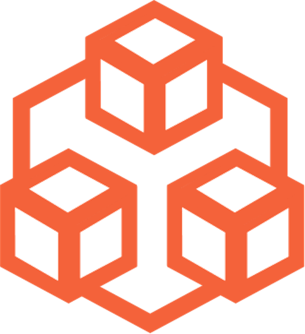

###   虫洞服务 常见问题与解答  Q&A

1. **服务预约金、开户服务费都要缴纳美金吗？**

   不用，缴纳等值人民币就可以了；

2. **汇率按什么标准？**

   按中行“现汇卖出价”汇率标准：https://www.bankofchina.com/；

3. **费率可以优惠吗？**

   累积汇款4万，可以返还100美金费用；

4. **美国开户的银行靠谱吗？**

   华美银行是上市公司，70年代创立的；《福布斯》发布的“2020全美百强银行榜”中，该行位居第11名/联邦存款保险；

5. **开户需要哪些资质，国内就可以开吗？**

   只需要身份证就可以，在国内就可以开美国银行的账户；需要人工审核，时间是一天，周六日顺延；

6. **币信担保靠谱吗？**

   担保原理是三方监管账户；转账时间1小时，也就是说担保时间就1小时，时间短风险趋近于零；

7. **为什么用signal不用微信？**

   因为signal是加密的，微信是被监控的，所以为了双方的安全，特意使用signal；

   苹果手机直接在应用市场搜索signal；

   安卓手机直接在signal官网下载安装文件：https://signal.org/android/apk/

8. **服务预约怎么还收费呢？**

   实际转账后这个费用返还的；是为了保障预约能准时到；尊重双方的时间；

9. **PPD是什么组织？**

   PPD是“点对点支付自治组织”的英文缩写，这是一个基于区块链技术实现去中心化信任的组织。

10. **为什么要提前3/4天预约？**

    一个是准备工作需要时间，例如美国开户/征信查询等；第二个是服务紧俏，需要排队等待。

11. **为什么你们都是匿名的？**

    我们崇尚信任制度而不是个人，全程有资金1:1担保，所以谁服务您都保障服务质量。

12. **熟悉数字美元交易的人，是否自己就可以完成“虫洞服务”？**

    不可以，因为熟悉数字美元的人，并不能将数字美元兑换为实际美元，以及不能离岸开美国银行账户；

    而且，熟悉数字美元的人的抗风控能力一般情况会比PPD差。

13. **你们的担保功能，不是面对面（例如我人在国外）可以实现吗？**

    可以实现，因为担保功能是通过APP（底层是智能合约）实现，手机上操作就可以，不需要人面对面。
