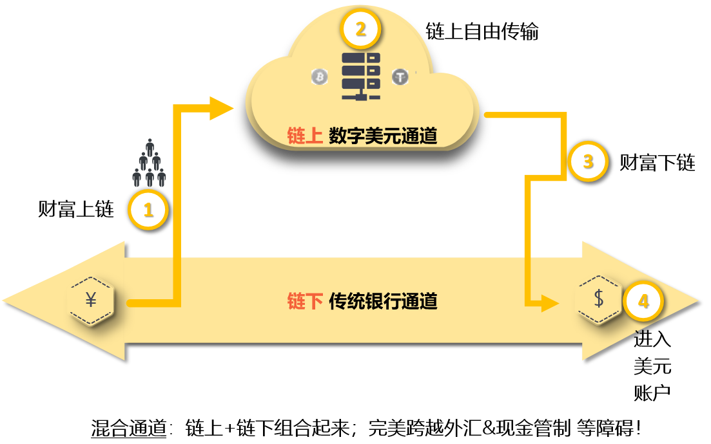

###  PPD 组织简介

------

###  PPD 独特的“混合通道”解决思路

​		有了数字货币通道并不意味着要取缔传统银行通道，相反需要的是融合！因此PPD解决方案的底层思路是：混合通道！

------

###  PPD 四大核心能力：抗风控能力+智能担保能力+数字美元兑换美元能力+美国银行离岸开户能力

------

###  详解：智能担保原理

​		链上世界财富是可以自由传输的，而信任是重要的前提；好在区块链技术可以做到比较彻底的“去信任化”，也就是说用智能合约保障信任，所以可以与不认识/没有信任历史（去信任化）的人进行交易。

​		整个担保过程和房产交易当中的银行（第三方）共管账户类似，也就是这个账户中的资金只有双方同意了才能转账。
