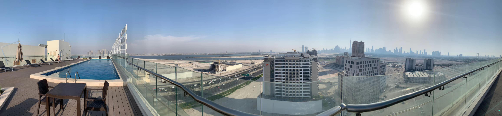
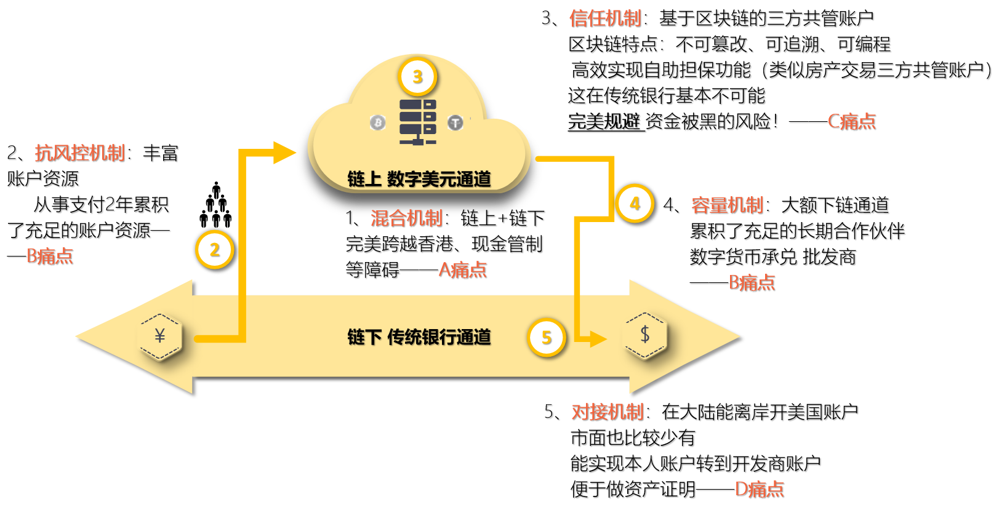

###  PPD“混合通道”效果：客户及利润倍增！

​		通过与PPD的合作，迪拜房产销售商达成了客户及利润倍增的效果！

​		增加一个通道自然客户增加很多，同时提升了交易体验和杜绝了资金风险，这样提升了交易成功率；所以利润倍增！

###  制约迪拜购房行业发展的“四大瓶颈”

​		能达成良好效果的原因是PPD解决了行业发展的“四大瓶颈”，这四大瓶颈分析如下：

###  PPD“混合通道”如何解决四大瓶颈？

